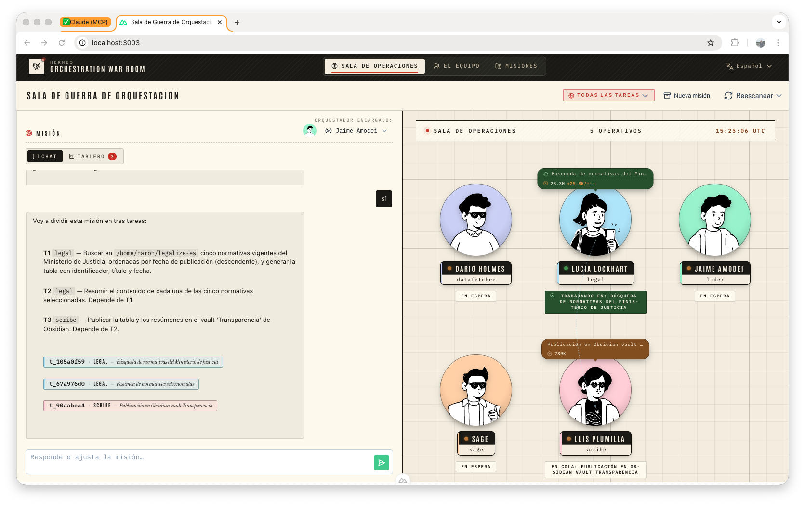

# Orchestration War Room



> *A multilingual visual UI for Hermes agentic orchestration/delegation system.*

[🇪🇸 Leer en español ↓](#sala-de-operaciones-de-orquestación)

A browser dashboard on top of [Hermes Agent](https://hermes-agent.nousresearch.com)'s multi-profile delegation and kanban systems. Hermes already gives you everything
you need to run a fleet of specialised agents that hand work to each other — the Orchestration War Room just makes that fleet **visible**, **legible**, and **directable**
from a single screen instead of a forest of terminal sessions and `hermes kanban tail` invocations.

> **TL;DR** — Hire a leader and a team, brief the leader, watch the team 
> work. The War Room handles all the wiring (kanban delegation, status
> tracking, notifications) underneath.

---

## Quickstart

You need Hermes installed on the host (the war-room shells out to the `hermes` CLI, so they share a process namespace) and Node 22+.

```bash
#Grab the latest release and run it
mkdir -p ~/hermes-war-room && cd ~/hermes-war-room

curl -L -o hermes-war-room.tar.gz \
  https://github.com/Naroh091/hermes-war-room/releases/latest/download/hermes-war-room.tar.gz

tar xzf hermes-war-room.tar.gz

HERMES_HOME=$HOME/.hermes NITRO_HOST=127.0.0.1 NITRO_PORT=3000 \
  node .output/server/index.mjs
# → http://localhost:3000
```

Open **The Team** first to give each operative a callsign and a tailored
SOUL.md, then head to the **War Room** and brief the orchestrator with a
real mission. For development setup (`pnpm dev`), tmux recipes and
production tuning, see [Quick start](#quick-start) and [Production
install](#production-install-no-pnpm-no-source-checkout) below.

---

## Why does this exist?

Hermes has powerful primitives for multi-agent work:

- **Profiles** — isolated agent personas with their own SOUL.md, skills,
  tool permissions, model, and history.
- **`delegate_task`** — a synchronous in-process subagent call. Good for
  small one-shot reasoning fan-outs within a single turn.
- **Kanban** — a durable SQLite-backed task board where any profile can
  drop a row and any other profile (the *worker* for that assignee) will
  pick it up asynchronously, with parent/child dependencies, blocking,
  comments, and run history.

Both delegation paths work great. They are also **invisible** from the
outside: you talk to one profile in `hermes chat`, and the rest of the
fleet quietly hums along in background processes you can only inspect by
SSH-ing into your own machine and grepping logs.

The War Room is the **glass on the floor**: a real-time dashboard that
shows you the whole team, what each operative is currently thinking
about, what tasks are in flight, who delegated what to whom, and the
final results — all without leaving the browser. It's a thin
visualisation + coordination layer; the actual orchestration logic still
lives inside Hermes.

---

## What you see

Three pages:

### 1. War Room (`/`) — the live operations floor

The home view, split 50/50 between **mission control** (left) and the
**operatives floor** (right).

- **Mission control** has two tabs:
  - **Chat** — talk to the active orchestrator. Every message you send
    is wrapped in a hidden preamble that forces it to delegate via the
    kanban (no doing the work itself, no hallucinating task IDs).
  - **Board** — a 4-column kanban (Todo / Ready / Running / Blocked) of
    every active task on the floor. Cards show the assignee callsign,
    the task title, time elapsed, and the assignee colour stripe. Click
    a card to drill into that operative's dossier.
- **Operatives floor** renders each active profile as a "workstation":
  a circular disc tinted in the operative's assigned colour, the
  Notionists avatar standing on it, a name placard with a pulsing LED
  next to the callsign, and a status pill underneath ("Standing by",
  "Working on: …", "Blocked"). When the orchestrator is mid-thought,
  a comic-style speech bubble surfaces above the head with the live
  step (tool call or reasoning fragment).
- **Click any workstation → operative drill-down.** A side panel
  opens with everything that operative is doing right now and
  everything on their plate:
  - the **task currently executing** — full title and body of the
    kanban row, status badge, started-at and last-heartbeat
    timestamps;
  - **who delegated it** — chain back to the parent task and the
    operative that created it (with their colour stripe);
  - **subtasks they've delegated** — every child task they've
    spawned, with each one's status and assignee, so you can see
    the work they've fanned out;
  - **recent activity steps** — live timeline of tool calls and
    reasoning fragments coming off the SSE stream while the
    operative thinks;
  - **mission thread** — the read-only chat with the orchestrator
    if this operative is the active one.

  This is the place to come when you want to know *exactly* what a
  given agent is executing and what's queued up behind it, without
  opening a terminal.

### 2. The Team (`/team`) — the roster

The personnel file. Each profile is rendered as a paper ID badge
(lanyard hole, "Hermes · Operative" header strip in the assigned
colour, square portrait with crop marks, italic-serif callsign,
monospace data fields, real CSS-rendered barcode). Editable: rename
the callsign, randomise the avatar, retrain (toggle skills + tools),
hire new agents, fire (deactivate) existing ones.

### 3. Missions (`/missions`) — the archive

Paginated history of every mission ever opened. Filter by Open /
Archived / All. Click a mission to see the full read-only thread.

---

## How it actually works

### Concepts

- **Profile** — your raw Hermes profile (`hermes -p <slug>`). Stored
  in `~/.hermes/profiles/<slug>/`. The War Room discovers them by
  walking that directory and persists assigned avatars/colours/given
  names in its own local SQLite DB (`data/war-room.db`).
- **Operative** — a War Room dressed-up Profile: callsign, avatar,
  colour, active/inactive flag.
- **Orchestrator** — any operative chosen as the conversation partner
  for a mission. Convention is to have one dedicated orchestrator
  profile (e.g. `lider`) whose SOUL/skills tell it to *route, never
  execute*. Workers (e.g. `investigador`, `legal`) have full tool
  access and SOULs that tell them to *do the work*.
- **Mission** — a conversation thread between you and an
  orchestrator, persisted in `data/war-room.db`. Each mission has
  many user/assistant messages and an underlying ACP session that
  carries the model's context across turns.
- **Kanban task** — Hermes' native `kanban_create` row. The War Room
  doesn't define its own task system — it reads `~/.hermes/kanban.db`
  directly.

### Mission lifecycle

```
┌─────────┐                                         ┌─────────────┐
│  YOU    │ ─── 1. brief the orchestrator ───────► │ ORCHESTRATOR│
└─────────┘                                         │   (lider)   │
                                                    └──────┬──────┘
                                                           │
                                       2. terminal tool ► hermes kanban create …
                                                           │
                                                    ┌──────▼──────┐
                                                    │  KANBAN DB  │
                                                    │ (~/.hermes/ │
                                                    │  kanban.db) │
                                                    └──────┬──────┘
                                                           │
                  3. dispatcher claims tasks ──────────────┤
                                                           │
                              ┌────────────────────────────┼────────────────────────────┐
                              │                            │                            │
                       ┌──────▼──────┐              ┌──────▼──────┐              ┌──────▼──────┐
                       │ INVESTIGADOR│              │   LEGAL     │              │   WRITER    │
                       │  (worker)   │              │  (worker)   │              │  (worker)   │
                       └──────┬──────┘              └──────┬──────┘              └──────┬──────┘
                              │                            │                            │
                              │ kanban_complete + summary  │                            │
                              └────────────┬───────────────┴────────────────────────────┘
                                           │
                            4. War Room watcher detects done
                                           │
                            5. auto-nudge ► system msg ► orchestrator
                                           │
                                    ┌──────▼──────┐
                                    │ ORCHESTRATOR│ ── 6. summary back ──► YOU
                                    └─────────────┘
```

1. **Brief the orchestrator** — type your goal in the Chat tab.
2. **Orchestrator decomposes and delegates** — its skill-injected
   preamble forces it to call the `terminal` tool with explicit
   `hermes kanban create … --json` invocations. The War Room
   intercepts each completed `kanban create` from the ACP tool stream
   and registers the new task ID into a watch list (persisted to its
   own SQLite, so it survives restarts).
3. **Dispatcher picks tasks up** — Hermes' own dispatcher (`hermes
   gateway`) claims `ready` tasks and hands them to worker profiles
   in their own subprocesses. The War Room shows a "no dispatcher
   detected" warning if it's missing.
4. **Workers do the work** and call `kanban_complete` with a summary.
5. **Auto-nudge** — the War Room polls the watch list every few
   seconds. When a watched task transitions to `done` or `blocked`,
   it injects a synthetic system message back into the orchestrator's
   ACP session: *"these tasks just landed, summarise for the user."*
6. **Orchestrator replies** with the actual answer, integrating the
   workers' outputs. You see this appear naturally in the Chat tab,
   as if the orchestrator just spoke up on its own.

### Hire & fire

The team is mutable from the UI:

- **Hire** (`/team` → button) — wraps `hermes profile create
  <slug>`, optionally cloning config/SOUL/`.env` from an existing
  profile. The new profile shows up on the floor immediately.
- **Retrain** (per badge) — modal to edit the operative's identity
  (SOUL.md), allowed skills, MCP servers, model, behaviour rules
  (AGENTS.md), and pre-approved dangerous commands. Saving writes
  back into the profile's filesystem so the next ACP turn picks it
  up.
- **Fire** (inside Retrain) — `hermes profile delete`, removes from
  the floor.
- **Deactivate** (toggle on the badge) — keeps the profile but hides
  it from the live floor and skips it in the team-roster.md the
  orchestrator reads.

### Tech under the hood

- **Frontend**: [Nuxt 4](https://nuxt.com) + [Nuxt UI](https://ui.nuxt.com)
  + [Tailwind CSS v4](https://tailwindcss.com), with custom typography
  pairing **Antonio** (display) + **Instrument Serif** (italic
  callsigns) + **IBM Plex Mono** (data). Avatars from
  [Dicebear Notionists](https://www.dicebear.com).
- **Backend**: Nuxt's Nitro server. Talks to Hermes via the
  [Agent Client Protocol](https://github.com/zed-industries/agent-client-protocol)
  by spawning `hermes -p <slug> acp` subprocesses and pooling them
  per-profile. Reads the Hermes kanban DB directly (SQLite,
  read-only).
- **Persistence**: a local SQLite (`data/war-room.db`) for War Room–
  specific state: operative customisations (callsign, avatar seed,
  colour, active flag), missions, mission messages, and the
  auto-nudge watch list.
- **Live updates**: per-mission Server-Sent Events stream for chunk /
  tool-call / done events; client-side polling for kanban (3s) and
  for the floor of operatives.

---

## Quick start

You need Hermes already installed on the host and at least one profile
created — the war-room shells out to the `hermes` CLI as a subprocess,
so it has to live in the same process namespace as the Node server.

```bash
# 1. Hermes profiles — at least an orchestrator and a worker.
hermes profile create lider           # the orchestrator
hermes profile create investigador    # a worker
hermes profile create legal           # another worker

# 2. Hermes dispatcher — claims kanban tasks and spawns the workers.
hermes gateway start

# 3. The war-room itself.
git clone https://github.com/Naroh091/hermes-war-room.git
cd hermes-war-room
pnpm install
pnpm dev
# → http://localhost:3000
```

The dev server hot-reloads on file changes and writes its own SQLite
state to `data/war-room.db` in the repo root.

---

## Production install (no `pnpm`, no source checkout)

Each push to `main` is auto-released by [semantic-release][sr] as a
self-contained Nuxt build (`.output/` includes everything; no
`node_modules` at runtime) attached to a GitHub Release.

[sr]: https://semantic-release.gitbook.io

```bash
# 1. Download the latest release.
mkdir -p ~/hermes-war-room && cd ~/hermes-war-room
curl -L -o hermes-war-room.tar.gz \
  https://github.com/Naroh091/hermes-war-room/releases/latest/download/hermes-war-room.tar.gz
# Optional: verify the checksum.
curl -L -O https://github.com/Naroh091/hermes-war-room/releases/latest/download/hermes-war-room.tar.gz.sha256
sha256sum -c hermes-war-room.tar.gz.sha256
tar xzf hermes-war-room.tar.gz

# 2. Run with node — needs Node 22+ and `hermes` available on PATH.
HERMES_HOME=$HOME/.hermes \
NITRO_HOST=127.0.0.1 \
NITRO_PORT=3000 \
node .output/server/index.mjs
```

To pin to a specific version: `gh release download v1.2.3 -p
hermes-war-room.tar.gz` instead.

### Why a release, not `pnpm dev`?

| | `pnpm dev` | tarball + node |
|---|---|---|
| Cold start | ~5–10 s | ~300 ms |
| HMR / live reload | ✅ | ❌ |
| Idle memory | 400+ MB | ~80 MB |
| Survives reboot | needs tmux | systemd-friendly |
| Edit-and-test loop | instant | needs re-release |

For developing the war-room itself: `pnpm dev`. For *using* it as a
running service: the tarball.

### Keeping it running across terminal sessions

`pnpm dev` ties to your foreground terminal — close the SSH session or
the tab and Nitro dies. Wrap both Hermes' dispatcher and the war-room
in a `tmux` session so they survive logouts and reboots-of-your-mind:

```bash
# First time:
tmux new -s hermes
# Inside tmux:
hermes gateway start          # ctrl-b c → new window
pnpm dev                      # in the second window
# Detach with ctrl-b d. Re-attach later with:
tmux attach -t hermes
```

`tmux ls` lists running sessions; `tmux kill-session -t hermes` shuts
the whole thing down cleanly.

Once the war-room is up, open **The Team** first to give your
operatives a callsign and a SOUL.md tailored to what each one does.
Then go to the **War Room** and brief the orchestrator with a real
mission.

---

# Sala de Operaciones de Orquestación

Una capa visual de mando construida sobre los sistemas de delegación
multi-perfil y kanban de [Hermes Agent](https://hermes-agent.nousresearch.com).
Hermes ya te da todo lo que necesitas para tener una flota de agentes
especializados que se pasan trabajo entre sí — la Sala de Operaciones
sólo hace que esa flota sea **visible**, **legible** y **dirigible**
desde un único panel, en lugar de un bosque de terminales y mil
`hermes kanban tail` simultáneos.

> **TL;DR** — Contrata a un líder y a su equipo, dale una misión al
> líder, observa al equipo trabajar. La Sala se encarga de todo el
> cableado por debajo (delegación kanban, seguimiento de estado,
> notificaciones).

---

## ¿Por qué existe?

Hermes tiene primitivas potentes para trabajo multi-agente:

- **Perfiles** — personajes-agente aislados con su propio SOUL.md,
  habilidades, permisos de herramientas, modelo e historial.
- **`delegate_task`** — llamada síncrona en proceso a un sub-agente.
  Buena para reparto pequeño y de un solo disparo dentro de un mismo
  turno.
- **Kanban** — tablero de tareas durable respaldado por SQLite donde
  cualquier perfil puede dejar una fila y otro perfil (el *worker* de
  ese asignee) la recoge de forma asíncrona, con dependencias
  padre/hijo, bloqueos, comentarios e historial de runs.

Ambos caminos funcionan estupendamente. También son **invisibles**
desde fuera: hablas con un único perfil en `hermes chat` y el resto
de la flota zumba calladamente en procesos en segundo plano que sólo
puedes inspeccionar haciendo SSH a tu propia máquina y grepeando logs.

La Sala de Operaciones es el **cristal sobre la planta**: un
dashboard en tiempo real que te muestra al equipo entero, qué está
pensando cada operativo en este momento, qué tareas están en vuelo,
quién delegó qué a quién, y los resultados finales — todo sin salir
del navegador. Es una capa fina de visualización + coordinación; la
lógica real de orquestación sigue viviendo dentro de Hermes.

---

## Lo que ves

Tres páginas:

### 1. Sala de Guerra (`/`) — la planta de operaciones en directo

La vista principal, partida 50/50 entre **control de misión**
(izquierda) y la **planta de operativos** (derecha).

- **Control de misión** tiene dos pestañas:
  - **Chat** — habla con el orquestador activo. Cada mensaje que
    envías va envuelto en un preámbulo oculto que le obliga a delegar
    vía kanban (sin hacer el trabajo él mismo, sin alucinar IDs de
    tarea).
  - **Tablero** — un kanban de 4 columnas (Pendientes / Listas / En
    curso / Bloqueadas) con todas las tareas activas en la planta.
    Las cards muestran el callsign del asignee, el título, tiempo
    transcurrido y la franja de color del operativo. Click en una
    card para abrir su dossier.
- La **planta de operativos** renderiza cada perfil activo como un
  "puesto de trabajo": un disco circular tintado del color asignado,
  el avatar Notionists encima, una placa con LED parpadeante junto al
  callsign, y una pastilla de estado debajo ("En espera",
  "Trabajando en: …", "Bloqueada"). Cuando el orquestador está
  pensando, aparece un bocadillo cómic encima de su cabeza con el
  paso live (tool call o fragmento de razonamiento).
- **Flechas de delegación** — cuando la tarea de un operativo tiene
  como padre la tarea de otro operativo, se dibuja una curva SVG
  entre sus puestos en el suelo, animada con "hormigas marchando"
  cuando el hijo está `running`.
- **Click en cualquier puesto → drill-down del operativo.** Se
  abre un panel lateral con todo lo que está haciendo en ese
  momento y todo lo que tiene en su plato:
  - la **tarea que está ejecutando ahora** — título y cuerpo
    completo de la fila de kanban, badge de estado, timestamps de
    inicio y último heartbeat;
  - **quién se la delegó** — la cadena hasta la tarea padre y el
    operativo que la creó (con su franja de color);
  - **subtareas que ha delegado** — cada tarea hija que ha
    creado, con su estado y asignee, para que veas el trabajo que
    ha desplegado;
  - **actividad reciente** — timeline live de llamadas a tools y
    fragmentos de razonamiento que salen del stream SSE mientras
    el operativo está pensando;
  - **hilo de misión** — el chat con el orquestador en modo
    lectura si este operativo es el activo.

  Es el sitio al que ir cuando quieres saber *exactamente* qué
  está ejecutando un agente y qué tiene en cola por detrás, sin
  abrir terminal.

### 2. El Equipo (`/team`) — la plantilla

El expediente de personal. Cada perfil se renderiza como una
tarjeta de identificación de papel (agujero del cordón, banda
"Hermes · Operativo" del color asignado, retrato cuadrado con marcas
de imprenta, callsign en serif italic, campos de datos en monospace,
código de barras renderizado en CSS). Editable: renombrar callsign,
aleatorizar avatar, reentrenar (toggle skills + tools), contratar
nuevos agentes, despedir (desactivar) existentes.

### 3. Misiones (`/missions`) — el archivo

Histórico paginado de toda misión que se haya abierto. Filtra por
Abiertas / Archivadas / Todas. Click en una misión → hilo completo
en modo lectura.

---

## Cómo funciona realmente

### Conceptos

- **Perfil** — tu perfil Hermes crudo (`hermes -p <slug>`). Vive en
  `~/.hermes/profiles/<slug>/`. La Sala los descubre recorriendo ese
  directorio y persiste avatares / colores / nombres asignados en su
  propia SQLite local (`data/war-room.db`).
- **Operativo** — un Perfil vestido por la Sala: callsign, avatar,
  color, flag activo/inactivo.
- **Orquestador** — cualquier operativo elegido como interlocutor
  para una misión. La convención es tener un perfil dedicado (p.ej.
  `lider`) cuyo SOUL/skills le dicen *enrutar, nunca ejecutar*. Los
  workers (p.ej. `investigador`, `legal`) tienen acceso completo a
  tools y SOULs que les dicen *hacer el trabajo*.
- **Misión** — un hilo de conversación entre tú y un orquestador,
  persistido en `data/war-room.db`. Cada misión tiene varios mensajes
  user/assistant y una sesión ACP subyacente que mantiene el contexto
  del modelo entre turnos.
- **Tarea kanban** — la fila nativa de `kanban_create` de Hermes. La
  Sala no define su propio sistema de tareas — lee directamente
  `~/.hermes/kanban.db`.

### Ciclo de vida de una misión

```
┌─────────┐                                         ┌─────────────┐
│   TÚ    │ ── 1. briefing al orquestador ────────►│ ORQUESTADOR │
└─────────┘                                         │   (lider)   │
                                                    └──────┬──────┘
                                                           │
                                  2. terminal tool ► hermes kanban create …
                                                           │
                                                    ┌──────▼──────┐
                                                    │  KANBAN DB  │
                                                    │ (~/.hermes/ │
                                                    │  kanban.db) │
                                                    └──────┬──────┘
                                                           │
              3. el dispatcher reclama tareas ─────────────┤
                                                           │
                              ┌────────────────────────────┼────────────────────────────┐
                              │                            │                            │
                       ┌──────▼──────┐              ┌──────▼──────┐              ┌──────▼──────┐
                       │ INVESTIGADOR│              │   LEGAL     │              │   WRITER    │
                       │   (worker)  │              │  (worker)   │              │  (worker)   │
                       └──────┬──────┘              └──────┬──────┘              └──────┬──────┘
                              │                            │                            │
                              │ kanban_complete + summary  │                            │
                              └────────────┬───────────────┴────────────────────────────┘
                                           │
                       4. el watcher de la Sala detecta done
                                           │
                       5. auto-nudge ► mensaje sistema ► orquestador
                                           │
                                    ┌──────▼──────┐
                                    │ ORQUESTADOR │ ── 6. resumen ─► TÚ
                                    └─────────────┘
```

1. **Briefing al orquestador** — escribes tu objetivo en la pestaña
   Chat.
2. **El orquestador descompone y delega** — su preámbulo skill-
   inyectado le obliga a llamar al tool `terminal` con invocaciones
   explícitas `hermes kanban create … --json`. La Sala intercepta
   cada `kanban create` completado del stream ACP y registra el ID
   de la nueva tarea en una watch list (persistida en su propia
   SQLite, sobrevive a reinicios).
3. **El dispatcher recoge tareas** — el dispatcher propio de Hermes
   (`hermes gateway`) reclama tareas `ready` y las entrega a perfiles
   worker en sus propios subprocesos. La Sala muestra un aviso "no
   se detecta dispatcher" si falta.
4. **Los workers hacen el trabajo** y llaman `kanban_complete` con un
   summary.
5. **Auto-nudge** — la Sala consulta la watch list cada pocos
   segundos. Cuando una tarea vigilada pasa a `done` o `blocked`,
   inyecta un mensaje sintético de sistema en la sesión ACP del
   orquestador: *"estas tareas acaban de aterrizar, resúmelas para el
   usuario."*
6. **El orquestador responde** con la respuesta real, integrando los
   outputs de los workers. Lo ves aparecer naturalmente en el Chat,
   como si el orquestador hablara por su cuenta.

### Contratar y despedir

El equipo es mutable desde el UI:

- **Contratar** (`/team` → botón) — wrapper de `hermes profile
  create <slug>`, opcionalmente clonando config / SOUL / `.env` de un
  perfil existente. El nuevo perfil aparece en la planta
  inmediatamente.
- **Reentrenar** (por badge) — modal para editar la identidad del
  operativo (SOUL.md), las skills permitidas, los servidores MCP, el
  modelo, las reglas de comportamiento (AGENTS.md) y los comandos
  peligrosos pre-aprobados. Al guardar se escribe en el sistema de
  ficheros del perfil para que el siguiente turno ACP lo recoja.
- **Despedir** (dentro de Reentrenar) — `hermes profile delete`, lo
  saca de la planta.
- **Desactivar** (toggle en el badge) — mantiene el perfil pero lo
  oculta de la planta y lo salta en el `team-roster.md` que lee el
  orquestador.

### Tecnología por debajo

- **Frontend**: [Nuxt 4](https://nuxt.com) + [Nuxt UI](https://ui.nuxt.com)
  + [Tailwind CSS v4](https://tailwindcss.com), con un pareo
  tipográfico custom: **Antonio** (display) + **Instrument Serif**
  (callsigns en italic) + **IBM Plex Mono** (datos). Avatares de
  [Dicebear Notionists](https://www.dicebear.com).
- **Backend**: el server Nitro de Nuxt. Habla con Hermes vía el
  [Agent Client Protocol](https://github.com/zed-industries/agent-client-protocol)
  spawneando subprocesos `hermes -p <slug> acp` y poolándolos por
  perfil. Lee la kanban DB de Hermes directamente (SQLite, sólo
  lectura).
- **Persistencia**: SQLite local (`data/war-room.db`) para estado
  específico de la Sala: customizaciones de operativos (callsign,
  semilla del avatar, color, flag activo), misiones, mensajes de
  misión y la watch list de auto-nudge.
- **Updates en directo**: stream Server-Sent Events por misión para
  eventos de chunk / tool-call / done; polling client-side para el
  kanban (3s) y para la planta de operativos.

---

## Inicio rápido

Necesitas tener Hermes instalado en el host y al menos un perfil creado
— la sala lanza la CLI `hermes` como subproceso, así que tiene que
vivir en el mismo namespace de procesos que el server Node.

```bash
# 1. Perfiles de Hermes — al menos un orquestador y un worker.
hermes profile create lider           # el orquestador
hermes profile create investigador    # un worker
hermes profile create legal           # otro worker

# 2. Dispatcher de Hermes — reclama tareas kanban y lanza los workers.
hermes gateway start

# 3. La sala en sí.
git clone https://github.com/Naroh091/hermes-war-room.git
cd hermes-war-room
pnpm install
pnpm dev
# → http://localhost:3000
```

El dev server hace hot-reload al cambiar ficheros y escribe su propio
estado SQLite en `data/war-room.db` dentro del repo.

---

## Instalación en producción (sin `pnpm`, sin clonar el repo)

Cada push a `main` genera un release automático con
[semantic-release][sr-es] como build de Nuxt autocontenido (`.output/`
lleva todo, no necesita `node_modules` en runtime) adjunto al release
de GitHub.

[sr-es]: https://semantic-release.gitbook.io

```bash
# 1. Descargar la última release.
mkdir -p ~/hermes-war-room && cd ~/hermes-war-room
curl -L -o hermes-war-room.tar.gz \
  https://github.com/Naroh091/hermes-war-room/releases/latest/download/hermes-war-room.tar.gz
# Opcional: verificar checksum.
curl -L -O https://github.com/Naroh091/hermes-war-room/releases/latest/download/hermes-war-room.tar.gz.sha256
sha256sum -c hermes-war-room.tar.gz.sha256
tar xzf hermes-war-room.tar.gz

# 2. Arrancar con node — necesita Node 22+ y `hermes` en el PATH.
HERMES_HOME=$HOME/.hermes \
NITRO_HOST=127.0.0.1 \
NITRO_PORT=3000 \
node .output/server/index.mjs
```

Para fijar versión: `gh release download v1.2.3 -p
hermes-war-room.tar.gz`.

### ¿Por qué un release y no `pnpm dev`?

| | `pnpm dev` | tarball + node |
|---|---|---|
| Arranque en frío | ~5–10 s | ~300 ms |
| HMR / live reload | ✅ | ❌ |
| Memoria en idle | 400+ MB | ~80 MB |
| Sobrevive a reboot | con tmux | systemd-friendly |
| Bucle editar-probar | instantáneo | requiere re-release |

Para desarrollar la sala: `pnpm dev`. Para *usarla* como servicio
encendido: tarball.

### Mantenerlo corriendo entre sesiones de terminal

`pnpm dev` se ata al terminal en primer plano — cierras la sesión SSH o
la pestaña y Nitro muere. Mete tanto el dispatcher de Hermes como la
sala en una sesión `tmux` para que sobrevivan a logouts y a tus
despistes:

```bash
# Primera vez:
tmux new -s hermes
# Dentro de tmux:
hermes gateway start          # ctrl-b c → ventana nueva
pnpm dev                      # en la segunda ventana
# Te desconectas con ctrl-b d. Vuelves luego con:
tmux attach -t hermes
```

`tmux ls` lista las sesiones corriendo; `tmux kill-session -t hermes`
apaga todo limpiamente.

Una vez arrancada, abre primero **El Equipo** para darle a tus
operativos un callsign y un SOUL.md adaptado a lo que hace cada uno.
Después vete a la **Sala de Guerra** y dale al orquestador una misión
real.
